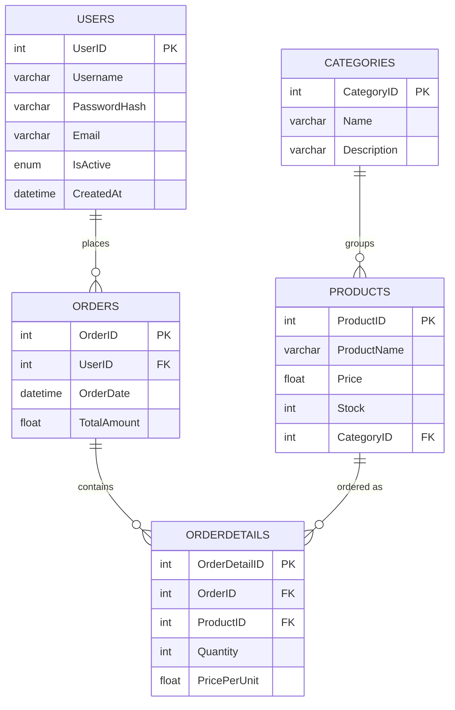

<!-- 1) BANNER -->
<p align="center">
  
</p>

<!-- 2) TYPING SVG -->
<p align="center">
  <a href="https://github.com/dyntr">
    
  </a>
</p>

<!-- 3) BADGES -->
<p align="center">
  
  
  
  
  
  
</p>

## Overview

**THÉTA** is a desktop order-management application: a Tkinter GUI over a MySQL database of users, products, categories, orders and order details. It was built as a larger "ročníková práce" school project to practice relational schema design end-to-end — from the `CREATE TABLE` script to a working transactional checkout in a real GUI.

## ✦ Features

- **Login / registration** with SHA-256 password hashing (`hashlib`) and an account status check (`Aktivní` / `Neaktivní` / `Pozastaveno`) — inactive accounts can't log in.
- **Tabbed GUI** (`ttk.Notebook`) covering the whole workflow: bulk **import** (CSV/JSON/XML, with automatic `Category` → `CategoryID` lookup), manual **insert**, a generic **CRUD table manager** (search + sort on any table), **order creation**, a simpler **sale** flow (stock deduction only), a **data view**, and **reports**.
- **Transactional order creation** — placing an order inserts into `Orders` and `OrderDetails` and decrements `Products.Stock` in one commit; if stock is insufficient or any step fails, the whole transaction rolls back and nothing is written.
- **Reports** read from an `OrderSummary` SQL view (order totals per user) and export to CSV.
- **Active Record–style models** (`User`, `Order`, `OrderDetail` in `models.py`) sitting on top of small `fetch_all` / `execute_query` helpers (`db_operations.py`) — a pattern picked deliberately after comparing Active Record vs. Row Data Gateway.
- Optional **PyInstaller** build into a standalone `.exe`.

## 🛠 Built with

Python 3.9+, Tkinter, `mysql-connector-python`, `pandas` (CSV/JSON import), `pyinstaller` (optional packaging).

## 🧭 Data model



## 📦 Getting started

Requires Python 3.9+ and a local MySQL server.

```bash
pip install -r requirements.txt

# create the PVDB schema, tables and the OrderSummary view
mysql -u root -p < data/MySQLdatabase.sql

# edit data/config.json with your own MySQL host / user / password
```

Then launch the app **as a module from the project root** — the code imports itself as `src.*`, so `python src/main.py` (as the project's own original docs suggested) actually throws `ModuleNotFoundError`; the verified working command is:

```bash
python3 -m src.main
```

## 🎓 What I learned

Designing a normalized schema with foreign keys and a reporting view, wrapping multi-table writes in real commit/rollback transactions with `mysql-connector-python`, comparing the Active Record and Row Data Gateway patterns before picking one, and building a multi-tab desktop UI in Tkinter.

## 🚀 Status

Built during studies at SPŠE Ječná — a school project demonstrating database-backed desktop application design, not a deployed point-of-sale system.

<!-- FOOTER -->
---
<p align="center">
  <sub>Part of <a href="https://github.com/dyntr">Patrick Dyntr's</a> portfolio · Built by <a href="https://github.com/dyntr">@dyntr</a></sub>
</p>
